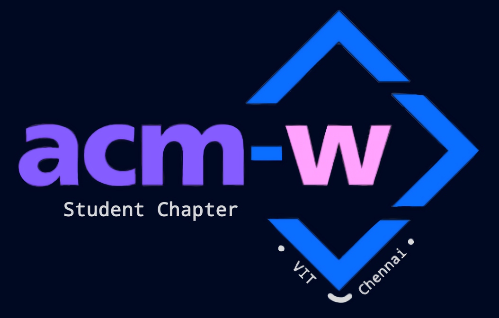

<h1 align="center">
    
  ACM-W UI/UX Contest
</h1>

  Welcome to the official GitHub repository for the ACM-W UI/UX Contest! This repository showcases the Readme files of all the participating teams.

---

## Team Name: [Team Name]

### Team Members:
- Member 1: [Role/Responsibility]
- Member 2: [Role/Responsibility]
- Member 3: [Role/Responsibility]

### Tool(s) Used:
- [Tool 1]
- [Tool 2]
- [Tool 3]

### Theme Selected:

<kbd>OTT</kbd> <kbd>e-Commerce</kbd> <kbd>Event Management</kbd>

### Link to the Design:
[Design Link](https://example.com) and
[Screenshots]

### Description of the Components and Functionalities of Our Design:
[Provide a detailed description of the components and functionalities of your design. Explain the key features, user interactions, and any innovative aspects of your design. You can also mention any challenges faced during the design process and how you overcame them.]

---

Please replace [Team Name], [Member X], [Role/Responsibility], [Tool X], [Theme Name], and [Design Link] with the appropriate information for your team.

Also, make sure to provide a comprehensive description of your design, highlighting its unique aspects and functionality.

---

**Thank you for participating in the ACM-W UI/UX Contest!**
We look forward to reviewing your design and wish you the best of luck.
